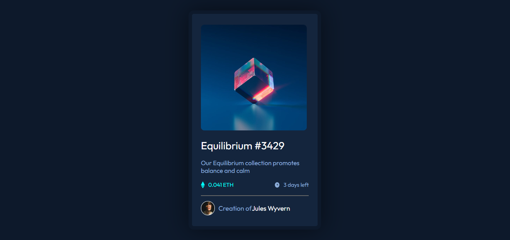
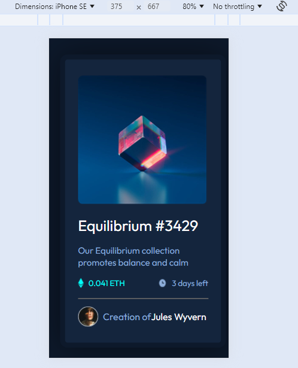

# Make It Real - NFT- preview-card

This is a solution to the NFT preview card component project of the Make It Real course.

## Table of contents

- [Make It Real - NFT- preview-card](#make-it-real---nft--preview-card)
  - [Table of contents](#table-of-contents)
  - [Overview](#overview)
    - [The challenge](#the-challenge)
    - [Screenshot](#screenshot)
    - [Built with](#built-with)
    - [What I learned](#what-i-learned)
    - [Useful resources](#useful-resources)
  - [Author](#author)
  - [Acknowledgments](#acknowledgments)


## Overview

### The challenge

Users should be able to:

- Replic the page web
- Flexbox practice

### Screenshot
DESKTOP

MOBILE



### Built with

- HTML5
- CSS
- Flexbox

### What I learned

Aprendi a usar las modificaciones para hacer una pagina responsable

```html
<span>3 days left</span>
```
```css
.attribution a:hover {
  color: var(--highlight-cyan);
}
```

### Useful resources
Linkedln Profile
MDN Web Docs
Video tutorial - Danto

## Author

- GITHUB - [@Aricatri](https://github.com/Aricatri)

## Acknowledgments
Css
Html
